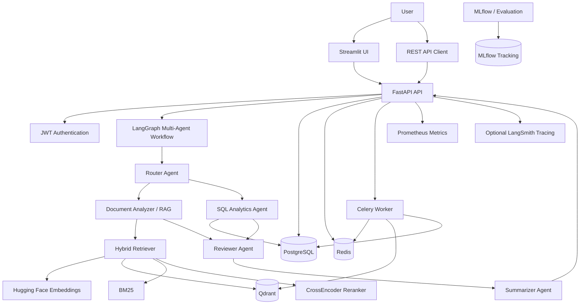

# EMAKIP — Enterprise Multi-Agent Knowledge & Intelligence Platform

> A production-style enterprise AI platform that combines multi-agent orchestration, Retrieval-Augmented Generation (RAG), document intelligence, SQL analytics, asynchronous processing, observability, MLOps, containerization, Kubernetes, Terraform, and CI/CD in one end-to-end project.

---

## Table of Contents

- [Overview](#overview)
- [Project Goals](#project-goals)
- [Key Features](#key-features)
- [System Architecture](#system-architecture)
- [Technology Stack](#technology-stack)
- [Repository Structure](#repository-structure)
- [How the Platform Works](#how-the-platform-works)
- [Multi-Agent Architecture](#multi-agent-architecture)
- [RAG Pipeline](#rag-pipeline)
- [Document Processing](#document-processing)
- [API Layer](#api-layer)
- [Authentication and Security](#authentication-and-security)
- [Database Layer](#database-layer)
- [Background Processing](#background-processing)
- [User Interface](#user-interface)
- [MLOps and Observability](#mlops-and-observability)
- [Docker Environment](#docker-environment)
- [Kubernetes Deployment](#kubernetes-deployment)
- [Terraform Infrastructure](#terraform-infrastructure)
- [CI/CD](#cicd)
- [Testing Strategy](#testing-strategy)
- [Configuration](#configuration)
- [Quick Start with Docker](#quick-start-with-docker)
- [Local Development](#local-development)
- [Demo Account](#demo-account)
- [API Endpoints](#api-endpoints)
- [Useful Commands](#useful-commands)
- [Design Decisions](#design-decisions)
- [Production Considerations](#production-considerations)
- [What This Project Demonstrates](#what-this-project-demonstrates)
- [Future Improvements](#future-improvements)
- [License](#license)

---

## Overview

**EMAKIP** stands for **Enterprise Multi-Agent Knowledge & Intelligence Platform**.

The project was designed as a complete enterprise-style AI system rather than a single chatbot or isolated machine-learning demo. It demonstrates how modern AI capabilities can be integrated with a traditional backend architecture, persistent storage, asynchronous workers, infrastructure-as-code, automated testing, observability, and deployment pipelines.

The platform allows authenticated users to:

- upload enterprise documents;
- process and index those documents asynchronously;
- search a private knowledge base using hybrid retrieval;
- ask questions against indexed content;
- route questions through a multi-agent workflow;
- retrieve platform-level analytics from PostgreSQL;
- inspect sources, confidence, and visible agent execution steps;
- monitor the application through metrics and MLOps tooling.

The repository intentionally includes application code, data access, AI orchestration, infrastructure, tests, CI/CD, and documentation in the same project so that the complete lifecycle of an enterprise AI application can be studied.

---

## Project Goals

The main goals of EMAKIP are to demonstrate:

1. **Clean modular architecture** for a larger Python application.
2. **Multi-agent orchestration** using LangGraph.
3. **Retrieval-Augmented Generation** over uploaded business documents.
4. **Hybrid information retrieval** that combines vector similarity and lexical relevance.
5. **Optional reranking** using a CrossEncoder model.
6. **Secure REST APIs** using FastAPI and JWT authentication.
7. **Persistent application state** in PostgreSQL.
8. **Background document processing** with Celery and Redis.
9. **Vector storage and semantic search** with Qdrant.
10. **An interactive enterprise UI** using Streamlit.
11. **Evaluation and experiment tracking** using MLflow.
12. **Application metrics and observability** using Prometheus-compatible metrics.
13. **Containerized local development** using Docker Compose.
14. **Kubernetes deployment manifests** with Kustomize overlays.
15. **Infrastructure as Code** using Terraform.
16. **Automated quality control** through tests, linting, type checking, pre-commit hooks, and GitHub Actions.

---

## Key Features

### Multi-Agent Intelligence

The application implements a LangGraph-based workflow containing several specialized agents:

- **Router Agent** — decides whether a request should use document retrieval or SQL analytics.
- **Document Analyzer Agent** — retrieves evidence from the indexed knowledge base.
- **SQL Analytics Agent** — executes predefined safe analytical queries against the platform database.
- **Reviewer Agent** — checks whether sufficient evidence is available and assigns a confidence value.
- **Summarizer Agent** — produces the final response from retrieved evidence.

The workflow exposes high-level agent execution status for transparency while avoiding exposure of private chain-of-thought reasoning.

### Enterprise RAG

The RAG subsystem supports:

- PDF ingestion;
- DOCX ingestion;
- plain-text and Markdown files;
- recursive chunking;
- semantic chunking components;
- Hugging Face sentence embeddings;
- Qdrant vector search;
- BM25 lexical scoring;
- hybrid vector + lexical scoring;
- CrossEncoder reranking;
- source-aware responses;
- configurable retrieval parameters.

### Secure API

The FastAPI backend includes:

- user registration;
- user login;
- JWT access tokens;
- protected routes;
- document upload;
- document listing;
- document deletion;
- AI chat;
- analytics;
- agent status;
- health check;
- Prometheus-compatible metrics.

### Asynchronous Processing

Document ingestion is delegated to a Celery worker so that large document processing does not block HTTP requests.

Redis is used as the Celery broker and result backend.

### Full Deployment Stack

The repository includes:

- Dockerfiles for API, UI, worker, and MLOps services;
- Docker Compose for a complete local environment;
- Kubernetes manifests;
- Kustomize staging and production overlays;
- Terraform modules;
- GitHub Actions CI/CD workflows.

---

## System Architecture



The architecture diagrams included in the repository can also be found under:

```text
docs/architecture/
├── multi_agent_flow.png
├── rag_pipeline.png
└── system_overview.drawio.svg
```

---

## Technology Stack

| Area | Technologies |
|---|---|
| Language | Python 3.12 |
| Backend API | FastAPI, Uvicorn |
| Validation | Pydantic, Pydantic Settings |
| AI Orchestration | LangGraph, LangChain |
| Optional LLM | OpenAI through LangChain |
| Embeddings | Sentence Transformers / Hugging Face |
| Reranking | CrossEncoder |
| Vector Database | Qdrant |
| Lexical Retrieval | BM25 |
| ML Runtime | PyTorch |
| Relational Database | PostgreSQL |
| ORM | SQLAlchemy Async |
| Database Migrations | Alembic |
| Background Jobs | Celery |
| Message Broker / Backend | Redis |
| UI | Streamlit |
| PDF Processing | PyMuPDF |
| DOCX Processing | python-docx |
| Data Processing | Pandas, NumPy |
| Report Support | ReportLab, OpenPyXL |
| Metrics | prometheus-client |
| Logging | structlog |
| Experiment Tracking | MLflow |
| Optional Tracing | LangSmith |
| Containers | Docker, Docker Compose |
| Orchestration | Kubernetes, Kustomize |
| Infrastructure as Code | Terraform |
| CI/CD | GitHub Actions |
| Testing | Pytest, pytest-asyncio |
| Linting | Ruff |
| Static Typing | mypy |
| Git Hooks | pre-commit, Husky |

---

## Repository Structure

```text
emakip-platform/
│
├── .github/
│   └── workflows/
│       ├── ci.yml
│       ├── cd-staging.yml
│       ├── cd-production.yml
│       └── mlops-eval.yml
│
├── .husky/
│   ├── pre-commit
│   └── pre-push
│
├── config/
│   ├── agents_config.yaml
│   ├── base.py
│   ├── logging_config.py
│   └── rag_config.yaml
│
├── docker/
│   ├── api.Dockerfile
│   ├── worker.Dockerfile
│   ├── ui.Dockerfile
│   ├── mlops.Dockerfile
│   └── docker-compose.yml
│
├── docs/
│   ├── api/
│   │   └── openapi.json
│   ├── architecture/
│   │   ├── multi_agent_flow.png
│   │   ├── rag_pipeline.png
│   │   └── system_overview.drawio.svg
│   └── user_guide.md
│
├── k8s/
│   ├── base/
│   └── overlays/
│       ├── staging/
│       └── production/
│
├── scripts/
│   ├── evaluate_rag.py
│   ├── run_migrations.sh
│   ├── seed_database.py
│   └── train_reranker.py
│
├── src/
│   ├── agents/
│   │   ├── graph.py
│   │   ├── state.py
│   │   ├── nodes/
│   │   └── tools/
│   │
│   ├── api/
│   │   ├── main.py
│   │   ├── dependencies.py
│   │   ├── schemas/
│   │   └── v1/
│   │
│   ├── core/
│   │   ├── config.py
│   │   ├── database.py
│   │   ├── exceptions.py
│   │   ├── security.py
│   │   └── telemetry.py
│   │
│   ├── db/
│   │   ├── migrations/
│   │   ├── models/
│   │   └── repositories/
│   │
│   ├── mlops/
│   │   ├── evaluation.py
│   │   ├── langsmith_tracing.py
│   │   └── mlflow_tracker.py
│   │
│   ├── rag/
│   │   ├── chunking/
│   │   ├── embeddings/
│   │   ├── extractors/
│   │   ├── loaders/
│   │   ├── reranking/
│   │   ├── vector_store/
│   │   └── retriever.py
│   │
│   ├── ui/
│   │   ├── app.py
│   │   ├── assets/
│   │   ├── components/
│   │   └── pages/
│   │
│   └── worker.py
│
├── terraform/
│   ├── environments/
│   ├── modules/
│   │   ├── eks_gke_cluster/
│   │   ├── postgres_db/
│   │   └── vector_database/
│   ├── main.tf
│   ├── variables.tf
│   └── outputs.tf
│
├── tests/
│   ├── unit/
│   ├── integration/
│   ├── e2e/
│   └── conftest.py
│
├── .env.example
├── .gitignore
├── .pre-commit-config.yaml
├── alembic.ini
├── Makefile
├── poetry.lock
├── pyproject.toml
├── run.ps1
├── run.sh
└── README.md
```

---

## How the Platform Works

A typical user interaction follows this lifecycle:

1. The user registers or logs in through the Streamlit interface or REST API.
2. The backend returns a JWT access token.
3. The user uploads a document such as a PDF, DOCX, TXT, or Markdown file.
4. FastAPI validates the file and stores metadata in PostgreSQL.
5. The ingestion request is placed on the Celery queue.
6. A worker loads the document, extracts text, divides it into chunks, generates embeddings, and stores vectors in Qdrant.
7. The document status changes from `queued` to `processing` and finally to `ready` or `failed`.
8. The user submits a question.
9. LangGraph starts the multi-agent workflow.
10. The router chooses the appropriate processing path.
11. For document questions, the RAG pipeline retrieves relevant evidence.
12. For analytics questions, a safe predefined database query is executed.
13. The reviewer evaluates evidence availability.
14. The summarizer creates the final answer.
15. The API returns:
    - the answer;
    - selected route;
    - confidence;
    - source excerpts;
    - visible execution steps.
16. The conversation is persisted in PostgreSQL.

---

## Multi-Agent Architecture

The agent workflow is implemented in:

```text
src/agents/
```

The graph is defined in:

```text
src/agents/graph.py
```

### Workflow

```text
START
  │
  ▼
Router Agent
  │
  ├───────────────┐
  ▼               ▼
RAG Agent      SQL Analytics Agent
  │               │
  └───────┬───────┘
          ▼
     Reviewer Agent
          │
          ▼
    Summarizer Agent
          │
          ▼
         END
```

### Router Agent

The router performs lightweight request classification.

Examples of SQL-oriented questions include:

```text
How many users are registered?
How many documents are stored?
What is the conversation count?
```

Questions referring to uploaded knowledge, policies, contracts, or documents are routed to the RAG path.

### Document Analyzer

The document analyzer calls the retrieval tool and converts the retrieved chunks into structured evidence.

### SQL Analytics Agent

The SQL agent does **not** accept arbitrary SQL from the user.

Instead, it maps supported analytical questions to predefined safe metrics such as:

- user count;
- document count;
- conversation count.

This reduces SQL injection risk and demonstrates a safer pattern for agent/database interaction.

### Reviewer Agent

The reviewer checks whether evidence was found and assigns a confidence value.

This introduces an explicit verification step before final answer generation.

### Summarizer Agent

The summarizer supports two modes:

**With an OpenAI API key**

The configured model is called through `langchain-openai` and instructed to answer using only supplied evidence.

**Without an OpenAI API key**

The platform falls back to deterministic local synthesis so that the entire application can still be demonstrated without an external LLM.

---

## RAG Pipeline

The RAG implementation is located under:

```text
src/rag/
```

### Retrieval Flow

```text
User Query
    │
    ▼
Query Embedding
    │
    ▼
Qdrant Vector Search
    │
    ▼
Candidate Documents
    │
    ├── Vector Similarity Score
    │
    └── BM25 Lexical Score
             │
             ▼
       Hybrid Scoring
             │
             ▼
     Candidate Sorting
             │
             ▼
   CrossEncoder Reranking
             │
             ▼
        Top Evidence
```

### Hybrid Retrieval

The retriever combines:

- **70% vector similarity**
- **30% lexical BM25 score**

The implementation normalizes lexical scores and produces a combined hybrid score.

Conceptually:

```text
hybrid_score =
    0.7 × vector_score +
    0.3 × lexical_score
```

This is useful because semantic and exact-keyword retrieval solve different problems.

Vector search performs well when the query and source text have similar meaning but different wording, while BM25 is useful for exact terms, names, identifiers, and domain-specific vocabulary.

### Reranking

After hybrid retrieval, a CrossEncoder can rerank the strongest candidates.

The configured default reranker is:

```text
cross-encoder/ms-marco-MiniLM-L-6-v2
```

If reranking fails, the system gracefully falls back to the highest hybrid-scored candidates instead of failing the complete request.

### Embeddings

The default embedding model is:

```text
sentence-transformers/all-MiniLM-L6-v2
```

Embeddings are generated locally through the Hugging Face / Sentence Transformers stack.

---

## Document Processing

Supported upload extensions are:

```text
.pdf
.docx
.txt
.md
```

Maximum file size:

```text
25 MB
```

### Ingestion Pipeline

```text
Upload
  │
  ▼
FastAPI Validation
  │
  ▼
PostgreSQL Metadata
  │
  ▼
Celery Queue
  │
  ▼
Document Loader
  │
  ▼
Text Extraction
  │
  ▼
Chunking
  │
  ▼
Embedding Generation
  │
  ▼
Qdrant Indexing
  │
  ▼
Document Status = ready
```

Document-processing components include:

```text
src/rag/loaders/
├── pdf_loader.py
├── docx_loader.py
└── ocr_loader.py
```

Additional extraction utilities include:

```text
src/rag/extractors/
├── metadata_extractor.py
└── table_extractor.py
```

The project also includes both recursive and semantic chunking modules.

---

## API Layer

The API is implemented using FastAPI.

Application entry point:

```text
src/api/main.py
```

The API includes:

- application lifespan management;
- database initialization;
- CORS middleware;
- API v1 routing;
- request metrics;
- health checks;
- Prometheus-compatible metrics.

Interactive API documentation is automatically available through Swagger UI.

Default local address:

```text
http://localhost:8000/docs
```

---

## Authentication and Security

Authentication-related logic is separated into:

```text
src/core/security.py
src/api/dependencies.py
src/api/v1/endpoints/auth.py
```

Implemented security concepts include:

- password hashing;
- password verification;
- JWT token creation;
- authenticated route dependencies;
- per-user document ownership checks;
- protected analytics and agent endpoints.

When deleting a document, the backend verifies that the current user owns the document before removing database metadata, local storage, and associated Qdrant vectors.

### Important

The credentials and secret values in `.env.example` are development examples only.

For a real deployment:

- generate a strong application secret;
- store secrets outside Git;
- use a secret manager;
- rotate credentials;
- enable TLS;
- configure production CORS rules;
- use centralized authentication where appropriate.

---

## Database Layer

PostgreSQL stores application metadata and business state.

The data layer follows a structured separation:

```text
src/db/
├── models/
├── repositories/
└── migrations/
```

### Models

The project contains models for:

- users;
- documents;
- conversations;
- audit logs.

### Repository Pattern

Data access is separated into repository classes:

```text
conversation_repository.py
document_repository.py
user_repository.py
```

This keeps database access logic outside route handlers and improves testability and maintainability.

### Async SQLAlchemy

The application uses SQLAlchemy's asynchronous APIs together with `asyncpg`.

### Alembic

Database schema changes are versioned through Alembic migrations.

Initial migration:

```text
src/db/migrations/versions/0001_initial_schema.py
```

---

## Background Processing

The worker implementation is located in:

```text
src/worker.py
```

The platform uses:

- **Celery** for asynchronous jobs;
- **Redis** as broker and result backend.

This design prevents document parsing, chunking, embedding generation, and vector indexing from blocking the FastAPI request lifecycle.

A document transitions through statuses such as:

```text
queued -> processing -> ready
```

or:

```text
queued -> processing -> failed
```

When an exception occurs, a limited error message is saved with the document record.

---

## User Interface

The user interface is implemented with Streamlit.

Entry point:

```text
src/ui/app.py
```

### Main Areas

The UI contains pages for:

- **Enterprise Chat**
- **Knowledge Base**
- **Analytics & Reports**
- **MLOps & System Status**

Reusable components are separated into:

```text
src/ui/components/
```

Examples include:

- chat interface;
- sidebar;
- document viewer;
- metrics dashboard;
- agent visualization.

Custom styling and UI assets are located in:

```text
src/ui/assets/
```

The interface supports registration and login before protected application content is shown.

---

## MLOps and Observability

### Evaluation

The project contains a lightweight evaluation layer for RAG responses.

Metrics include:

- **groundedness** — how much of the answer appears supported by supplied evidence;
- **answer relevance** — lexical overlap between the question and generated answer;
- **retrieval coverage** — amount of evidence returned relative to the expected retrieval set.

Evaluation implementation:

```text
src/mlops/evaluation.py
```

### MLflow

MLflow is used for experiment and metric tracking.

Implementation:

```text
src/mlops/mlflow_tracker.py
```

Default experiment:

```text
emakip-rag-evaluation
```

### LangSmith

Optional LangSmith tracing can be enabled through environment variables.

The project does not require LangSmith to run.

### Prometheus-Compatible Metrics

FastAPI collects request and RAG/agent metrics through `prometheus-client`.

The metrics endpoint is:

```text
GET /metrics
```

The application also tracks request latency and request counts.

---

## Docker Environment

Docker Compose provides the complete local platform.

Services include:

| Service | Purpose | Default Port |
|---|---|---:|
| `api` | FastAPI backend | 8000 |
| `ui` | Streamlit interface | 8501 |
| `worker` | Celery document-ingestion worker | — |
| `postgres` | Relational database | 5432 |
| `redis` | Celery broker/backend | 6379 |
| `qdrant` | Vector database | 6333 / 6334 |
| `mlflow` | Experiment tracking | 5000 |

Persistent Docker volumes are configured for:

- PostgreSQL data;
- Redis data;
- Qdrant storage;
- uploaded documents;
- Hugging Face model cache;
- MLflow data.

---

## Kubernetes Deployment

Kubernetes manifests are stored under:

```text
k8s/
```

### Base Resources

The base configuration includes:

- API deployment;
- UI deployment;
- worker deployment;
- PostgreSQL StatefulSet;
- Qdrant StatefulSet;
- Redis deployment;
- ingress.

### Kustomize

Environment-specific customization is separated into:

```text
k8s/overlays/staging/
k8s/overlays/production/
```

This allows the same base manifests to be reused while applying different environment settings.

---

## Terraform Infrastructure

Terraform configuration is stored under:

```text
terraform/
```

The repository contains reusable modules for:

```text
terraform/modules/
├── eks_gke_cluster/
├── postgres_db/
└── vector_database/
```

Environment-specific variable files are located in:

```text
terraform/environments/
├── dev.tfvars
└── prod.tfvars
```

The root Terraform configuration defines an AWS provider and connects the infrastructure modules through common project variables.

These modules are intended as an infrastructure starter/reference layer and should be hardened and adapted before production deployment.

---

## CI/CD

GitHub Actions workflows are located in:

```text
.github/workflows/
```

### Continuous Integration

`ci.yml` runs on pushes and pull requests.

The pipeline performs:

```text
Install dependencies
        │
        ▼
Ruff linting
        │
        ▼
mypy type checking
        │
        ▼
Pytest
```

### MLOps Evaluation

`mlops-eval.yml` supports:

- manual execution;
- scheduled weekly evaluation.

It runs:

```bash
python scripts/evaluate_rag.py
```

### Staging and Production

Separate workflow templates are provided for:

```text
cd-staging.yml
cd-production.yml
```

This separation demonstrates environment-aware continuous-delivery architecture.

---

## Testing Strategy

Tests are divided by scope.

```text
tests/
├── unit/
│   ├── test_chunking.py
│   ├── test_rag_retriever.py
│   └── test_sql_agent.py
│
├── integration/
│   ├── test_api_endpoints.py
│   └── test_vector_store.py
│
└── e2e/
    └── test_full_agent_workflow.py
```

### Unit Tests

Verify isolated components such as:

- chunking;
- RAG retrieval behavior;
- SQL agent logic.

### Integration Tests

Verify communication between larger subsystems, including:

- API endpoints;
- vector-store behavior.

### End-to-End Tests

Verify the complete agent workflow from request to final answer.

The project uses:

- `pytest`;
- `pytest-asyncio`.

---

## Configuration

The project uses environment variables for runtime configuration.

Create a local `.env` from the example:

```bash
cp .env.example .env
```

On Windows PowerShell:

```powershell
Copy-Item .env.example .env
```

### Important Environment Variables

| Variable | Purpose |
|---|---|
| `APP_NAME` | Application display name |
| `APP_ENV` | Runtime environment |
| `APP_DEBUG` | Debug mode |
| `API_HOST` | API bind host |
| `API_PORT` | FastAPI port |
| `UI_PORT` | Streamlit port |
| `SECRET_KEY` | JWT/application secret |
| `ACCESS_TOKEN_EXPIRE_MINUTES` | JWT expiration |
| `DATABASE_URL` | Async PostgreSQL connection URL |
| `REDIS_URL` | Redis/Celery connection |
| `QDRANT_URL` | Qdrant server |
| `QDRANT_COLLECTION` | Vector collection |
| `MLFLOW_TRACKING_URI` | MLflow tracking server |
| `LANGSMITH_TRACING` | Enable/disable LangSmith |
| `LANGSMITH_API_KEY` | Optional LangSmith API key |
| `OPENAI_API_KEY` | Optional OpenAI API key |
| `OPENAI_MODEL` | Optional OpenAI model |
| `EMBEDDING_MODEL` | Hugging Face embedding model |
| `RERANKER_MODEL` | CrossEncoder reranker |
| `TOP_K` | Initial retrieval candidate count |
| `RERANK_TOP_K` | Number of results retained after reranking |
| `CHUNK_SIZE` | Document chunk size |
| `CHUNK_OVERLAP` | Chunk overlap |
| `API_BASE_URL` | API location used by the UI |

Never commit a real `.env` containing production credentials.

---

## Quick Start with Docker

### Requirements

Recommended:

- Docker Desktop or Docker Engine;
- Docker Compose;
- approximately 8 GB RAM or more;
- Internet access on first startup to download model weights.

### 1. Clone the repository

```bash
git clone https://github.com/<your-username>/emakip-platform.git
cd emakip-platform
```

### 2. Create the environment file

Linux/macOS:

```bash
cp .env.example .env
```

Windows PowerShell:

```powershell
Copy-Item .env.example .env
```

### 3. Start the stack

```bash
docker compose -f docker/docker-compose.yml up --build -d
```

Alternatively, helper scripts are included.

Windows:

```powershell
Set-ExecutionPolicy -Scope Process Bypass
.\run.ps1
```

Linux/macOS:

```bash
chmod +x run.sh
./run.sh
```

### 4. Seed the demo user

```bash
docker compose -f docker/docker-compose.yml exec api python scripts/seed_database.py
```

### 5. Open the services

- Streamlit UI: `http://localhost:8501`
- FastAPI Swagger UI: `http://localhost:8000/docs`
- FastAPI health check: `http://localhost:8000/health`
- MLflow: `http://localhost:5000`
- Qdrant dashboard: `http://localhost:6333/dashboard`

The first startup may take longer because Hugging Face model weights are downloaded and cached.

---

## Local Development

The project requires Python 3.12 or newer.

### Create a virtual environment

Linux/macOS:

```bash
python -m venv .venv
source .venv/bin/activate
```

Windows PowerShell:

```powershell
python -m venv .venv
.\.venv\Scripts\Activate.ps1
```

### Install the project with development dependencies

```bash
pip install -e ".[dev]"
```

### Run quality checks

```bash
ruff check .
mypy src config
pytest
```

### Run FastAPI manually

```bash
uvicorn src.api.main:app --reload --host 0.0.0.0 --port 8000
```

### Run Streamlit manually

```bash
streamlit run src/ui/app.py
```

For the complete platform, PostgreSQL, Redis, and Qdrant still need to be available and configured.

---

## Demo Account

After running the database seed script:

```bash
docker compose -f docker/docker-compose.yml exec api python scripts/seed_database.py
```

use:

```text
Email:    admin@emakip.local
Password: Admin123!
```

These credentials are only intended for local demonstration.

Change them before deploying the application outside a controlled demo environment.

---

## API Endpoints

The API is versioned under:

```text
/api/v1
```

### Authentication

```http
POST /api/v1/auth/register
POST /api/v1/auth/login
```

### Documents

```http
POST   /api/v1/documents
GET    /api/v1/documents
DELETE /api/v1/documents/{document_id}
```

Document upload accepts:

```text
PDF
DOCX
TXT
Markdown
```

### Chat

```http
POST /api/v1/chat
```

The response contains:

- answer;
- selected route;
- confidence;
- agent execution steps;
- source items.

### Analytics

```http
GET /api/v1/analytics
```

Returns high-level platform counts for:

- users;
- documents;
- conversations.

### Agent Status

```http
GET /api/v1/agents/status
```

### Platform Health

```http
GET /health
```

### Metrics

```http
GET /metrics
```

For complete request/response schemas, open:

```text
http://localhost:8000/docs
```

or inspect:

```text
docs/api/openapi.json
```

---

## Useful Commands

### Start Docker stack

```bash
docker compose -f docker/docker-compose.yml up --build -d
```

### Stop Docker stack

```bash
docker compose -f docker/docker-compose.yml down
```

### View logs

```bash
docker compose -f docker/docker-compose.yml logs -f
```

### API logs

```bash
docker compose -f docker/docker-compose.yml logs -f api
```

### Worker logs

```bash
docker compose -f docker/docker-compose.yml logs -f worker
```

### Run migrations

```bash
docker compose -f docker/docker-compose.yml exec api bash scripts/run_migrations.sh
```

### Seed the database

```bash
docker compose -f docker/docker-compose.yml exec api python scripts/seed_database.py
```

### Run tests

```bash
pytest
```

### Run linting

```bash
ruff check .
```

### Run static type checks

```bash
mypy src config
```

### Run RAG evaluation

```bash
python scripts/evaluate_rag.py
```

---

## Design Decisions

### 1. Modular `src/` Architecture

Application concerns are separated into:

- API;
- agents;
- core services;
- database;
- RAG;
- MLOps;
- UI.

This avoids putting unrelated responsibilities in a single application file.

### 2. Repository Pattern

Route handlers do not directly contain all persistence logic. Repository classes encapsulate common database operations.

### 3. Async API and Database Layer

FastAPI and SQLAlchemy async APIs allow the backend to handle I/O operations efficiently.

### 4. Celery for Heavy Processing

Embedding generation and document indexing can be slow and CPU-intensive. Moving ingestion to a worker prevents HTTP requests from waiting for the complete process.

### 5. Hybrid RAG

Pure vector retrieval can miss exact terms, while pure lexical retrieval can miss semantically related content. Combining Qdrant vector search with BM25 provides a more robust retrieval strategy.

### 6. Reranking as a Separate Stage

Retrieval finds candidates quickly; CrossEncoder reranking performs a more expensive pairwise relevance evaluation only on the reduced candidate set.

### 7. Optional External LLM

The platform remains runnable without an external API key, while still supporting higher-quality LLM synthesis when an OpenAI key is configured.

### 8. Safe Analytics Agent

The database analytics agent uses predefined metrics rather than unrestricted user-generated SQL.

### 9. Explicit Review Stage

The reviewer agent provides a dedicated evidence-confidence stage before final synthesis.

### 10. Separate Application and Infrastructure Layers

Docker, Kubernetes, Terraform, tests, and CI/CD are committed alongside the application so deployment and operational concerns remain reproducible.

---

## Production Considerations

EMAKIP is a **production-style reference implementation and portfolio project**, not a turnkey regulated-industry production system.

Before a real production rollout, additional work should include:

- managed secret storage;
- TLS everywhere;
- production-grade CORS configuration;
- centralized authentication / OIDC / SSO;
- role-based authorization;
- database backups and disaster recovery;
- managed PostgreSQL;
- managed or clustered Qdrant;
- Redis high availability;
- Kubernetes network policies;
- resource requests and limits;
- horizontal autoscaling;
- pod disruption budgets;
- container vulnerability scanning;
- image signing;
- centralized logs;
- distributed tracing;
- alerting;
- rate limiting;
- API gateway controls;
- document malware scanning;
- data-retention policies;
- encryption at rest;
- privacy and compliance controls;
- dependency and supply-chain scanning;
- secret rotation;
- infrastructure state locking and remote Terraform state.

---

## What This Project Demonstrates

This repository demonstrates practical experience across several engineering areas.

### Backend Engineering

- REST API design
- authentication
- dependency injection
- async programming
- validation
- error handling
- service health endpoints

### Data Engineering

- PostgreSQL
- SQLAlchemy
- migrations
- repositories
- background processing
- data ingestion pipelines

### AI / LLM Engineering

- LangGraph
- multi-agent workflows
- RAG
- embeddings
- vector databases
- hybrid retrieval
- reranking
- evidence-grounded responses

### MLOps

- evaluation metrics
- MLflow experiment tracking
- optional tracing
- automated evaluation workflow

### DevOps

- Docker
- Docker Compose
- Kubernetes
- Kustomize
- Terraform
- CI/CD
- environment separation

### Software Quality

- unit tests
- integration tests
- end-to-end tests
- linting
- static type checking
- pre-commit hooks
- modular architecture

---

## Future Improvements

Possible next steps include:

- role-based access control;
- organization/workspace multi-tenancy;
- document-level permissions;
- streaming chat responses;
- WebSocket/SSE updates for ingestion status;
- more advanced router classification;
- LLM-based query rewriting;
- metadata filtering in Qdrant;
- reciprocal-rank fusion;
- contextual compression;
- stronger RAG evaluation datasets;
- LLM-as-a-judge evaluation;
- automated prompt/version tracking;
- caching;
- rate limiting;
- object storage such as S3;
- OCR integration for scanned PDFs;
- table-aware retrieval;
- citation highlighting in the document viewer;
- conversation memory;
- PostgreSQL connection pooling tuning;
- OpenTelemetry tracing;
- Prometheus/Grafana dashboards;
- Helm charts;
- autoscaling policies;
- production secret-management integration;
- managed-cloud deployment examples.

---

## License

This repository is intended as a learning, demonstration, and portfolio project.

If the project is published publicly, add a license file that matches the intended usage and distribution policy.

---

## Summary

EMAKIP brings together the major building blocks of a modern enterprise AI platform:

```text
FastAPI
  +
LangGraph Multi-Agent Orchestration
  +
Hybrid RAG
  +
Hugging Face Embeddings
  +
CrossEncoder Reranking
  +
Qdrant
  +
PostgreSQL
  +
Celery / Redis
  +
Streamlit
  +
MLflow
  +
Docker
  +
Kubernetes
  +
Terraform
  +
GitHub Actions
```

The result is an end-to-end reference architecture showing not only how an AI feature can be implemented, but also how it can be integrated into a larger software-engineering and deployment ecosystem.
